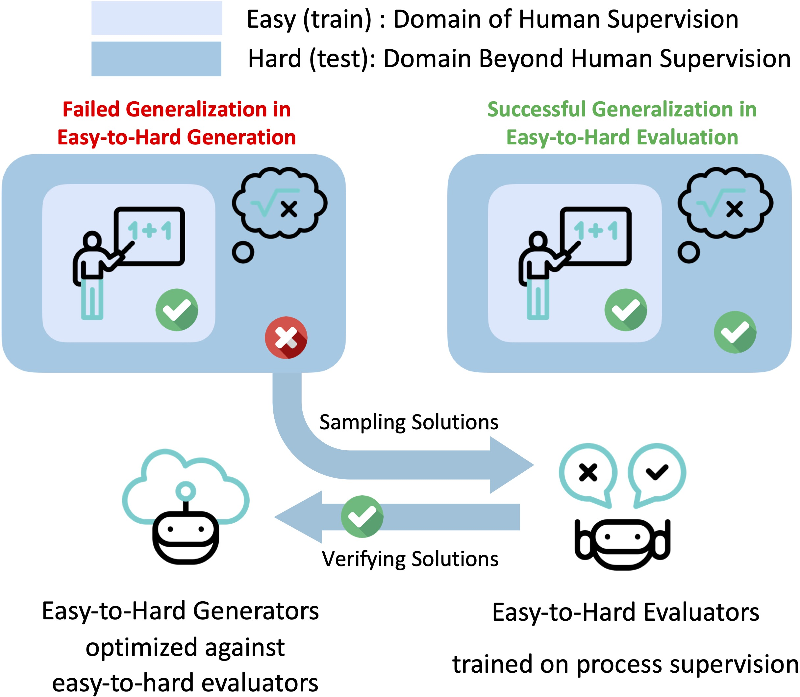

# Easy-to-Hard Generalization

### Easy-to-Hard Generalization: Scalable Alignment Beyond Human Supervision

Guided by the observation that *evaluation is easier than generation*, we enabled large language models to excel on hard math problems beyond human evaluation capabilities through the easy-to-hard generalization of evaluators (e.g., process reward models). For comprehensive details and insights, we kindly direct you to our [paper](https://huggingface.co/anonymized).

    

<!-- 

    

 -->

## Downloading pre-tuned PRM800K / MetaMath models

We provide model checkpoints for the supervised fine-tuned models and reward models. The current list of models includes:

- SFT models:

  - [`llemma-7b-sft-prm800k-level-1to3-hf`](https://huggingface.co/anonymized)
  - [`llemma-7b-sft-metamath-level-1to3-hf`](https://huggingface.co/anonymized)

- Reward models:

  - [`llemma-7b-oprm-prm800k-level-1to3-hf`](https://huggingface.co/anonymized)
  - [`llemma-7b-prm-prm800k-level-1to3-hf`](https://huggingface.co/anonymized)
  - [`llemma-7b-orm-prm800k-level-1to3-hf`](https://huggingface.co/anonymized)
  - [`llemma-7b-prm-metamath-level-1to3-hf`](https://huggingface.co/anonymized)

## Reproduction

Please check the [examples](/examples/) for the training scripts and [data](/data/) for the data preparation.
